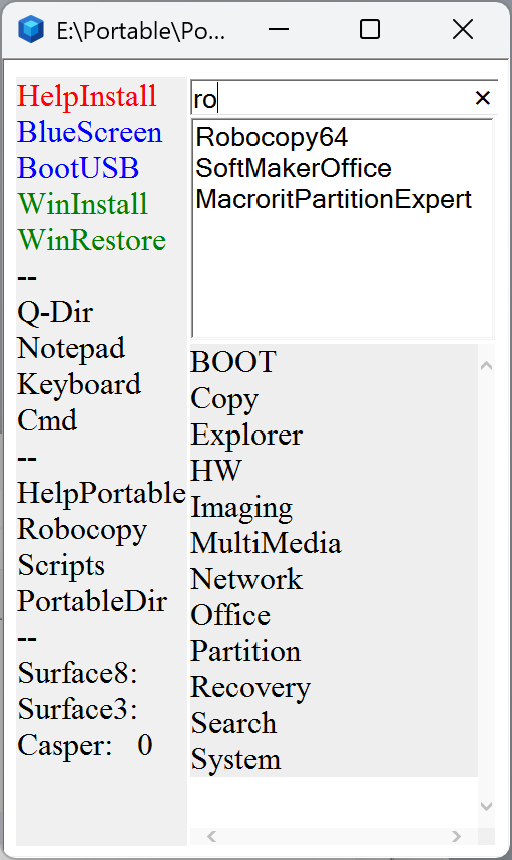

> **Warning:** This toolkit is intended for users familiar with Windows installation, partitioning, and recovery environments. Inexperienced users may cause data loss or system damage.
## 📦 Download

Full package — ready to use:
[Download from Google Drive](https://drive.google.com/file/d/1n5uB2U_6TDvj0tec0sguBgu3BQfN2IW6/view?usp=drive_link)
# BlueDesktop

![BlueDesktop]

A lightweight, portable system management toolkit that runs directly from Windows Recovery Environment (WinRE = Blue Screen) — no full Windows installation required.

BlueDesktop transforms the standard Windows Recovery Environment into a fully functional system management platform. Instead of a bare recovery screen, you get a custom HTA graphical interface with access to 50+ portable tools, backup/restore, and internet access — all without booting into Windows.

The same toolkit works identically in three environments:

1. Blue Screen (WinRE)
2. Full Windows desktop
3. Bootable USB

---

## Boot To Blue Screen

By using WinRE's built-in navigation — like the Notepad "Open" trick — as a file explorer, you can run portable apps, backups, and Windows setups directly from a local partition. This eliminates external media, ensures high-speed installs via local disk reads, and remains accessible for recovery even if the OS fails to boot. For a more luxurious experience, a custom HTA interface (BlueDesktop) can be injected into the WinRE environment via DISM to provide a persistent, mouse-driven launcher for setup files and recovery tools that survives system reinstalls.

WinRE essentially functions as a bootable environment, and since portable applications require no installation, they can be executed directly from any accessible partition via the file navigation method described below, much like running them from a bootable USB media.

- **With keyboard:** Launch a console from within WinRE, type `notepad`, then use File > Open to navigate the filesystem.
- **Mouse only:** Navigate to Troubleshoot → Advanced Options → System Image Recovery, then click Cancel on the prompt — this exposes a browse/search window that functions as a makeshift file explorer. From there, locate the executable you wish to run, right-click it, and launch it with elevated privileges (Run as Administrator).

---

## Windows Installation

You don't actually need any external tools to install Windows. You can easily perform the installation directly from WinRE — the blue screen interface. If Windows fails to boot, WinRE is already accessible by default. If Windows is running, you can also force-enter WinRE with a simple command (run as Administrator):

```
shutdown /r /o /t 0
```

Locate the extracted Windows installation files (i.e., an extracted ISO), right-click `setup.exe`, and run it with elevated privileges (Run as Administrator).

It is recommended to store the extracted Windows installation files on a dedicated data partition rather than the system volume, as the system partition is typically wiped during a clean installation. Keeping the files on a secondary data volume also benefits from fast local disk read speeds, significantly accelerating the installation process compared to external media. A clearly named folder such as `D:\Install\Windows` is advisable for quick access from within WinRE.

> If the primary drive has failed, WinRE will be inaccessible. In that case, performing a clean installation via bootable USB media becomes mandatory.

---

## System Backup and Restore

If you store a portable backup utility — such as Drive Snapshot — on your data partition, your system volume can be backed up and restored in a remarkably short time, preserving your settings and installed applications. Since the utility resides on the data partition, it remains accessible via the same WinRE file navigation method, even when the system volume is unbootable.

> Restoration of a full system image can be completed in a matter of seconds — a 44GB snapshot on NVMe, for instance, restores in approximately 90 seconds.

---

## BlueDesktop HTA Interface

To make the workflow even more luxurious, a lightweight HTA interface stored on the data partition (e.g., `D:\Portable\Portable.hta`) can be automatically launched on WinRE boot via a DISM-injected startup script — no keyboard, no menu traversal, no hunting through Advanced Options. Since the interface resides on the data partition, it survives system reinstallation and can be freely modified from within Windows at any time. It remains equally accessible from Windows, WinRE, and bootable USB media alike.

The launcher provides dedicated buttons for Windows Setup, Boot to WinRE, and a searchable categorized browser for portable tools — allowing you to launch a real file explorer such as Q-Dir, recovery utilities, or any other portable executable with a single click. The entire workflow becomes fully mouse-operable from a single, always-available interface.

### Interface Buttons

| Button | Description |
|---|---|
| HelpInstall | Opens help documents related to OS or software installation |
| BlueScreen | Reboots to WinRE (Blue Screen) |
| BootUSB | Launches tools to manage USB boot settings and help file |
| WinInstall | Starts installing a new Windows operating system |
| WinRestore | Initiates system recovery from existing Drive Snapshot backups |
| Q-Dir | Opens the Q-Dir quad-pane file manager |
| Notepad | Launches a basic text editor for notes or log files |
| Keyboard | Opens the on-screen keyboard |
| Cmd | Opens Command Prompt for executing manual system commands |
| HelpPortable | Documentation for the portable applications included in the suite |
| Robocopy | Runs a UI for the Robocopy directory replication tool |
| Scripts | Provides access to automated VBScript scripts via a UI |
| PortableDir | Opens the root folder where all portable tools are stored |

---

## How It Works

```
Blue screen  OR  click BlueScreen button on HTA interface
│
▼
WinRE loads (injected CMD triggers)
│
▼
HTA graphical interface opens
│
▼
Choose from 50+ portable tools
│
▼
Or: restore full system in ~90 seconds via Drive Snapshot
│
▼
Or: sync or copy files/folders with Robocopy
│
▼
Or: do whatever you want to do
```

> Everything runs from the data partition. Nothing is written to the system partition. This is not a RAM boot system. Files live on the data partition; only active processes run in RAM.

---

## Features

- **HTA Graphical Interface** — HTML Application launcher built with VBScript; auto-scans your Portable folder and generates program links dynamically
- **50+ Portable Tools** — Organized by category: Boot, Imaging, Network, Office, Recovery, Partition, Multimedia, and more
- **Drive Snapshot Integration** — Full system backup and restore in ~90 seconds for a 44GB system (NVMe speed)
- **Robocopy Sync** — Manual file synchronization triggered from the HTA interface
- **WinRE Injection** — A small CMD script injected into WinRE automatically launches the HTA interface on boot
- **Multi-Environment Compatible** — Identical behavior in WinRE, Windows, and USB environments

---

## System Requirements

| Component | Requirement |
|---|---|
| OS | Windows 7 or later |
| Storage | NVMe or SSD strongly recommended (HDD works but slowly) |
| Data Partition | Separate partition for portable tools and backups |
| USB (optional) | USB 3.0 minimum if running from USB |

---

## Installation

**Step 1** — Create a data partition on your NVMe/SSD. Recommended layout: `D:\` → Data partition

**Step 2** — Download and copy the entire contents of `BlueDesktop.7z` to the root of your data partition.

**Step 3** — Copy all contents of your `Windows.iso` into `D:\Install\Windows`. The folder `D:\Install\SystemBackup` is for your backups.

That is all!

### Optional Steps (Advanced Users)

**Step 4** — To edit WinRE, read `D:\Portable\BOOT\WimEdit\Read.txt`
This adds a small launcher entry to WinRE so the HTA interface opens automatically when WinRE starts.

**Step 5** — To prepare a Boot USB, read `D:\Portable\BOOT\BootUSB\Read.txt`

---

## Included Portable Tools

The HTA launcher auto-scans `D:\Portable` and builds the interface dynamically. No manual configuration needed.

| Category | Tools |
|---|---|
| BOOT | Bootice, BootUSB, Scripts, WimEdit, WinNTSetup, WinPeBuild |
| Copy | FastCopy 5.11.1 x64, Robocopy64 |
| Explorer | 7-Zip, Explorer++ x64, FreeCommanderXE, Q-Dir |
| HW | CPU-Z, CrystalDiskInfo, GPU-Z, HWInfo, PCI-Z |
| Imaging | Drive SnapShot 1.51 |
| MultiMedia | ByClickDownloader, FSCapture, ImagineFull, MediaInfo CLI x64, VLC Media Player |
| Network | Advanced IP Scanner, AnyDesk, Palemoon, PENetwork |
| Office | Notepad++, SoftMaker Office, SumatraPDF |
| Partition | Macrorit Partition Expert, MiniTool Partition Wizard x64 |
| Recovery | Lazesoft Recovery Suite, R-Studio 9.5, Recuva, TestDisk |
| Search | Agent Ransack x64, Everything x64 |
| System | Autoruns, BleachBit, FreeVK, OSKLaunch |

---

## License

This project is released under the **MIT License**. You are free to use, modify, and distribute the toolkit scripts and HTA interface.

> Portable programs, third-party tools, and drivers are subject to their own respective licenses. Purchase and license commercial software (such as Drive Snapshot) separately. Some tools included are shareware/trial versions. If you find them useful, please support the developers by purchasing a license. Delete them if you choose not to purchase.

> **Important:** Since WinRE allows running applications with administrator privileges, physical access to the machine should be restricted. Anyone with physical access can use this toolkit.
---

## Contributing

Pull requests are welcome. If you improve the HTA interface, add useful scripts, or expand driver support documentation, feel free to contribute.

---

## Acknowledgements

Built out of personal necessity. Developed and refined over approximately 2 months of daily use across multiple machines.

README documentation written with the assistance of [Claude](https://claude.ai) by [Anthropic](https://anthropic.com).
